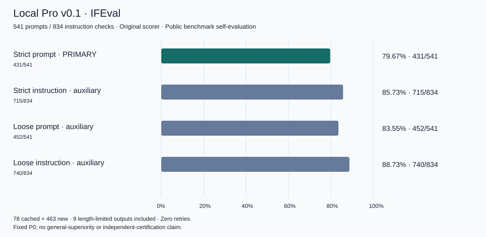
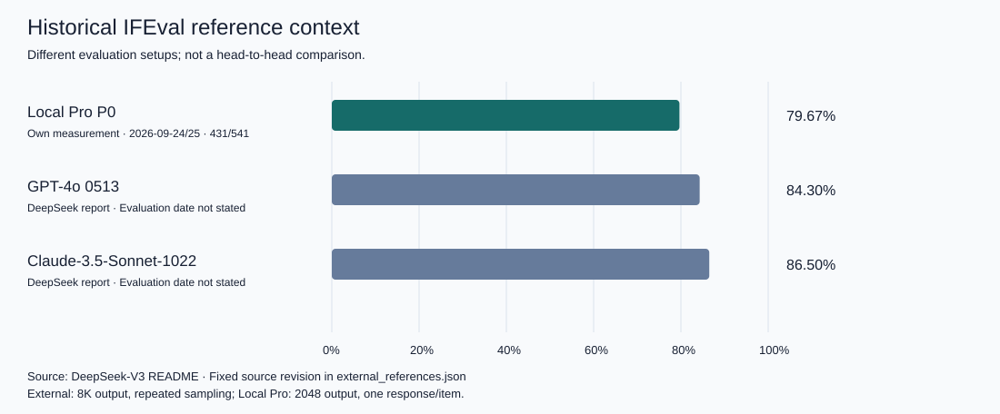

# Local Pro — IFEval Evaluation & Reporting on Apple Silicon

Local Pro is a local LLM evaluation harness and results package developed on a MacBook Pro, using a pinned Qwen-based 27B 4-bit MLX artifact and the original IFEval scorer.

**431/541 · 79.67% strict prompt accuracy.** Private review candidate; **PUBLICATION_HELD** remains for a future public release. This repository is code and a reproducible reporting package, not a newly trained foundation model.



| Metric | Correct / total | Accuracy |
|---|---:|---:|
| Strict prompt — primary | 431/541 | 79.67% |
| Strict instruction — auxiliary | 715/834 | 85.73% |
| Loose prompt — auxiliary | 452/541 | 83.55% |
| Loose instruction — auxiliary | 740/834 | 88.73% |

541 public prompts / 834 instruction checks; 78 verified cached + 463 new responses; all9 length-limited outputs retained (4 strict failures, 5 passes); zero retries. No score-based selection or denominator reduction.

## What works here

| Function | Requirement / limitation |
|---|---|
| Stored verdicts → scorecard and graphs | Included data, Python 3.12+ standard library; locally tested |
| Raw output → full541 rescore | Not possible from this repository alone: exact private raw and hash-pinned evaluation assets required |
| New model generation | Separate canonical core and valid execution authority required; not a standalone inference package |
| Fresh-computer installation/generation | Not tested |

The existing CLI is reused. Reporting is separated from optional scorer assets; the original scorer algorithms, generation protocol and native results were not changed. Model loading and network access are not part of reporting.

## Quick start — no installation or model needed

Run from the repository root with Python 3.12 or later. These command forms were executed in an isolated copy with an existing Python interpreter. Do not reuse output paths: overwrite is rejected.

```sh
PYTHONPATH=src python3 -B -m local_pro_release --help
PYTHONPATH=src python3 -B -m local_pro_release report --scores results/v0.1/scores.json --output out/report
PYTHONPATH=src python3 -B -m local_pro_release report --scores examples/verdicts.json --coverage examples/coverage.json --output out/example
python3 -B scripts/plot_results.py --output out/charts
PYTHONPATH=src python3 -B -m unittest discover -s tests -v
```

The [two-item synthetic example](examples/README.md) is usage data, not another benchmark. Expected strict prompt 1/2 and strict instruction 2/3. Generated reports contain both JSON and Markdown; graphs are deterministic SVG, with no CDN or external font.

Optional PNG previews were generated and visually inspected with macOS's installed `sips` (no added library). After the graph command, on macOS: `sips -s format png out/charts/ifeval.svg --out out/charts/ifeval.png`. The SVG is the canonical reproducible graphic.

`score` and `run --dry-run` stop with `MISSING_EVALUATION_ASSET:data/ifeval.jsonl` in this upload because uncertain-redistribution input/Punkt assets were deliberately excluded. [Exact missing asset hashes](docs/EXCLUDED_ASSETS.json) and [requirements](docs/OPTIONAL_PATHS.md) describe the boundary. Live run without a registration stops with `VALID_EXISTING_REGISTRATION_REQUIRED` before attempting model import. No new generation was performed here.

## Source layout

- `src/local_pro_release/cli.py`: original run/score/report CLI, atomic no-overwrite writes; minimal metadata-only report adaptation.
- `src/local_pro_release/runtime.py`: unchanged optional bridge to separately installed canonical core, not a new runner.
- `vendor/instruction_following_eval/`: unchanged author scorer source, Apache license and retained headers.
- `results/v0.1/`: original verdicts/summary, non-text coverage counts, source hashes and frozen settings.
- `scripts/plot_results.py`, `assets/`: JSON/verdict-derived figures and regeneration code.
- `tests/`, `examples/`: denominator/schema/integrity/report/chart checks and usage example.

## Frozen benchmark protocol and environment

Model `mlx-community/Qwen3.8-27B-4bit`, artifact revision `3e6447f082e89cc7f0bc6e5441afd38dfce760ff`, MLX affine4-bit group64. Quantizer names `Qwen/Qwen3.8-27B`; exact upstream conversion commit remains unverified. Tokenizer/template hashes are in unchanged [config.json](config.json); artifacts are not bundled.

P0: one exact original user message, no added system/few-shot/tools; context8192/output2048, temperature0/top_p1/seed42/thinkingfalse, one pass, concurrency1. Author IFEval code/data revision `e6890f85757dd84e27ca6df2dd30651dafad28e0`; scorer helper seed42. Earliest verified eligible cache response was used, not best-of selection. Cached and new records retain identical configuration binding.

All463 new native loads recorded48GiB physical RAM. The referenced **2026-09-09 historical profile** lists Apple M5 Max,18 CPU/40 GPU cores, macOS26.6.2 build25G83; those details are not a fresh per-run attestation. Generation runtime: Python3.12.13, mlx-vlm0.7.0, mlx/mlx-metal0.32.2, transformers5.16.1. Original scorer environment Python3.13.0 with `requirements.lock.txt`. [Environment evidence](results/v0.1/ENVIRONMENT.json).

## Reproducibility limits

Public/development-exposed IFEval self-evaluation—not hidden testing, third-party certification, a matched frontier comparison, or evidence of general superiority. Retained verdicts reproduce scores but cannot independently verify the private response text. The original full raw was locally rescored before packaging; this upload does not contain it. No new model performance measurement occurred during packaging.

## Historical external comparison context



Different evaluation setups; not a head-to-head comparison. References include a historical baseline, a nearby value, and higher values—not only results below Local Pro.

| Reference | Strict prompt accuracy | Reporting source |
|---|---:|---|
| GPT-4, responses from November 2023; API snapshot unspecified | 76.89% | Original IFEval paper, Table 3 |
| Local Pro P0 — own measurement | 79.67% | 431/541 stored benchmark verdicts |
| GPT-4o-mini-2024-07-18 | 80.4% | Qwen3 Technical Report, Table 14 |
| GPT-4o 0513 | 84.3% | DeepSeek-V3 README |
| Claude-3.5-Sonnet-1022 | 86.5% | DeepSeek-V3 README |

Local Pro is 2.78 percentage points above the historical GPT-4 reference and 0.73 points below the Qwen-reported GPT-4o mini reference. These numerical differences do not establish general superiority, equivalence, or statistical significance. External values are not Local Pro measurements or current-frontier claims. See [original sources and conditions](docs/EXTERNAL_CONTEXT.md). Ambiguous strict/loose results are excluded rather than used to claim a win.

## Credits and publication status

Qwen supplies the base model; MLX-community supplies the quantized conversion. Aiden's contribution is execution/evaluation integration, tracking, reporting code and reproducibility documentation, with Codex development assistance. No underlying foundation-model training is claimed.

[Third-party notices](THIRD_PARTY_NOTICES.md) distinguish external code from original contributions. Original-code MIT is a proposal only; no open-source grant is made. Raw responses, IFEval prompts, Punkt tables, weights, credentials and operational ledgers are excluded. PRIVATE review upload is separately authorized; PUBLIC release still requires license selection and final content/visibility approval.

### Final upload integrity

`python3 -B scripts/verify_upload.py` checks the entire candidate file set and Git-tracked file set against `UPLOAD_ALLOWLIST.json`, rejecting missing, unexpected, symlinked or modified files. Run on a clean checkout; keep generated reports outside it. The payload hash binds sorted file hashes and paths, excluding the self-index to avoid recursion; Git binds the index itself. This is integrity verification, not cryptographic publisher authentication or a guarantee that automated secret scanning finds every secret.

Current closeout remains **PRIVATE / PUBLICATION_HELD**: the conditional public-transition instruction does not choose an original-code license. MIT has not been applied. Historical measurement metadata is preserved unchanged.
